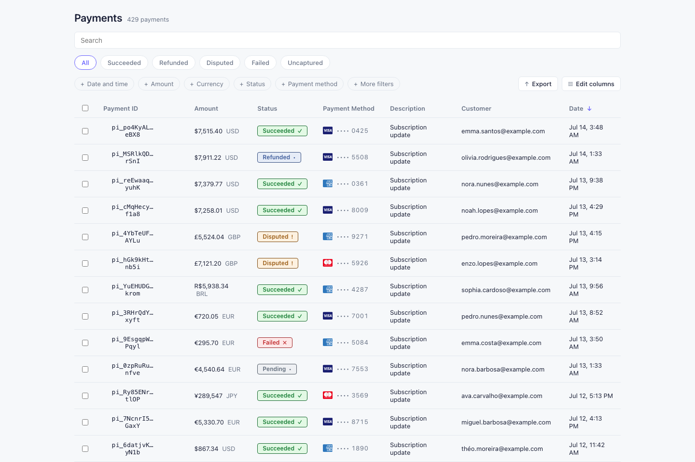

# Chargeblast — Payments Dashboard

Repositório: [ADICIONAR LINK] · Deploy: [ADICIONAR LINK]

Dashboard de pagamentos estilo Stripe, feito em Angular. Tabela paginável e ordenável, filtros (busca, status, forma de pagamento, período, valor) e dados mockados.



---

## 🇧🇷 Português

### Como rodar

```bash
npm install

npm start        # ng serve — http://localhost:4200

npm run build    # build de produção em dist/

npm test         # testes unitários (Vitest)

npx playwright install chromium   # uma vez, para baixar o navegador dos testes E2E
npm run e2e      # testes end-to-end (Playwright), sobe o app e roda em Chromium headless
```

### Estrutura

```
src/app/
├── app.routes.ts, app.config.ts        # bootstrap e rotas raiz
├── shared/
│   ├── components/                     # status-badge, payment-method-badge (reutilizáveis, sem estado)
│   └── pipes/                          # relative-time
└── features/payments/
    ├── models/                         # tipos: Payment, PaymentFilters, ColumnConfig
    ├── data-access/                    # PaymentRepository (interface) + implementação mock
    ├── state/                          # PaymentsStoreService (signals) + PaymentsFacade
    ├── payments-page/                  # componente contêiner da rota
    ├── payments-toolbar/               # título + contagem
    ├── payments-filters/                # busca, tabs de status, chips de filtro
    │   ├── payment-status-tabs/
    │   └── filter-chip/
    └── payments-table/                 # tabela, ordenação, paginação, copiar ID
```

- **Data access**: `PaymentRepository` é uma interface; `PaymentMockRepositoryService` gera de 300 a 1000 pagamentos determinísticos (seed fixa) na primeira injeção.
- **State**: `PaymentsStoreService` guarda os dados brutos e os critérios (filtros/ordenação/paginação) em signals e deriva tudo via `computed` (filtrado → ordenado → paginado). `PaymentsFacade` é a única porta de entrada exposta aos componentes de UI.
- **UI**: componentes standalone, `ChangeDetectionStrategy.OnPush`, comunicação por `input`/`output`. Nenhum componente de apresentação acessa a store diretamente — sempre via facade, injetada só na página.
- **Testes**: unitários com Vitest (`*.spec.ts`) e E2E funcionais com Playwright (`e2e/payments.spec.ts`).

### Qualidade e testes

- 24 testes E2E com Playwright cobrindo cada requisito funcional do desafio: colunas, filtros (data, status, forma de pagamento, valor, busca), ordenação, paginação e filtros combinados — além dos testes unitários com Vitest.
- A validação E2E encontrou e corrigiu 2 bugs reais antes da entrega:
  - o filtro de intervalo de valor comparava incorretamente moedas sem casas decimais (JPY) contra o mesmo divisor usado para moedas com centavos;
  - o filtro de data customizado tinha deslocamento de um dia em fusos horários negativos (UTC-3) por usar conversão UTC em vez de componentes de data locais.

---

## 🇺🇸 English

### Running the project

```bash
npm install

npm start        # ng serve — http://localhost:4200

npm run build    # production build into dist/

npm test         # unit tests (Vitest)

npx playwright install chromium   # once, to download the E2E test browser
npm run e2e      # end-to-end tests (Playwright), boots the app and runs headless Chromium
```

### Structure

```
src/app/
├── app.routes.ts, app.config.ts        # root bootstrap and routes
├── shared/
│   ├── components/                     # status-badge, payment-method-badge (stateless, reusable)
│   └── pipes/                          # relative-time
└── features/payments/
    ├── models/                         # types: Payment, PaymentFilters, ColumnConfig
    ├── data-access/                    # PaymentRepository (interface) + mock implementation
    ├── state/                          # PaymentsStoreService (signals) + PaymentsFacade
    ├── payments-page/                  # route container component
    ├── payments-toolbar/               # title + count
    ├── payments-filters/                # search, status tabs, filter chips
    │   ├── payment-status-tabs/
    │   └── filter-chip/
    └── payments-table/                 # table, sorting, pagination, copy ID
```

- **Data access**: `PaymentRepository` is an interface; `PaymentMockRepositoryService` generates 300–1000 deterministic payments (fixed seed) on first injection.
- **State**: `PaymentsStoreService` holds raw data and criteria (filters/sort/pagination) as signals and derives everything through `computed` (filtered → sorted → paginated). `PaymentsFacade` is the only entry point exposed to UI components.
- **UI**: standalone components, `ChangeDetectionStrategy.OnPush`, communication via `input`/`output`. No presentational component touches the store directly — always through the facade, injected only in the page component.
- **Tests**: unit tests with Vitest (`*.spec.ts`) and functional E2E tests with Playwright (`e2e/payments.spec.ts`).

### Quality and testing

- 24 E2E tests with Playwright covering every functional requirement in the challenge: columns, filters (date, status, payment method, amount, search), sorting, pagination and combined filters — plus unit tests with Vitest.
- E2E validation found and fixed 2 real bugs before delivery:
  - the amount-range filter incorrectly compared zero-decimal currencies (JPY) against the same divisor used for currencies with cents;
  - the custom date filter had a one-day offset in negative-UTC timezones (UTC-3) from using UTC conversion instead of local date components.
